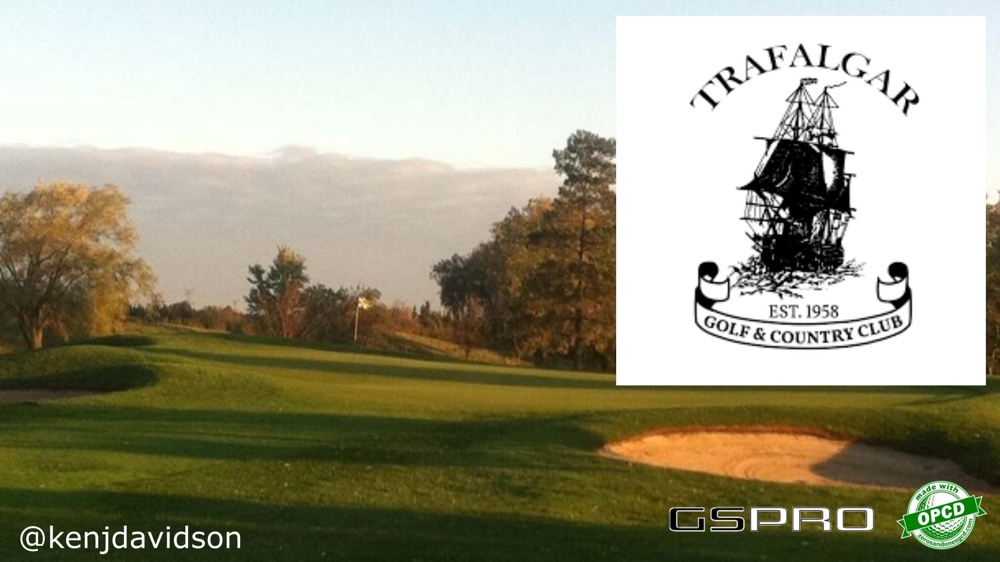

# Trafalgar Golf Club

> Trafalgar Golf Club was closed after the 2022 season to make way for business parks and warehouse developments. Bullshit!

In January 1958, Keith Robinson obtained an option to purchase Ruthven's sod farm to pursue his dream of building and operating his own golf course. Armed with his option and Robbie Robinson's hand-coloured layout of the course, Keith Robinson and Bob Watson convinced nine businessmen to invest in what would become Trafalgar Golf and Country Club. (In those days, the area was known as Trafalgar Township, which is why the name Trafalgar was chosen.)

The initial investors were: Earl Black, Walter Hayward, Murray Greeniaus, Ross Hawley (who had flown with Keith during the Second World War), Gleason Henderson, Ken Harmer, Grif Adamson, Keith Robinson, Ivan Slessor (who sold his shares in 1959), Robert Watson and Ross Watson. All of the remaining original investors, or their families, are still owners.

Over the years, the club had played host to the qualifying rounds of the Canadian Open, and was the home course for Oakville's Sandra Post, the first Canadian to win an LPGA major.

## Details

Some links regarding the sale of Trafalgar Golf Club.

- [Trafalgar Golf Club sold](https://www.hamiltonnews.com/news-story/9248838-trafalgar-golf-and-country-club-sold-to-real-estate-company/)
- [Facebook](https://www.facebook.com/trafalgargc/)

### Versions

#### Beta 1.1

- Club houses
- Colliders (forgot them first go round)
- Hole 7 green fixed to be an actual green

#### Beta 1.0

- Released course with basic vegetation and layout
